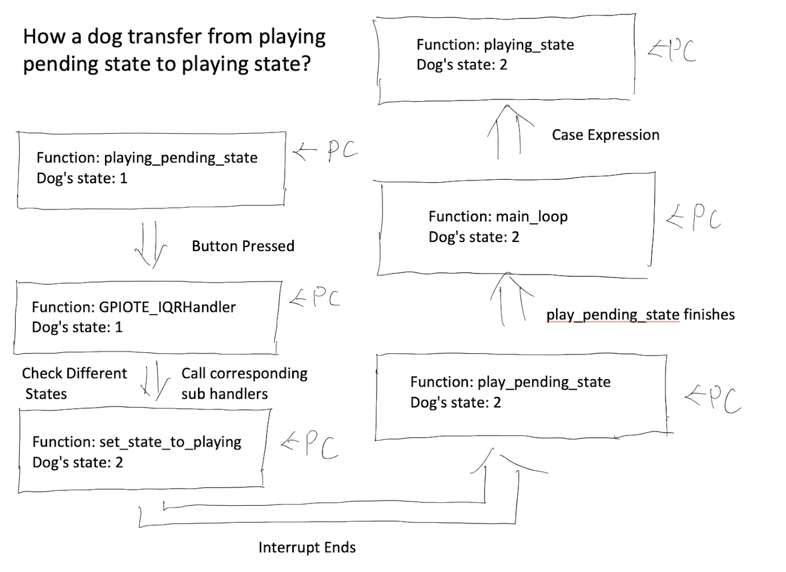
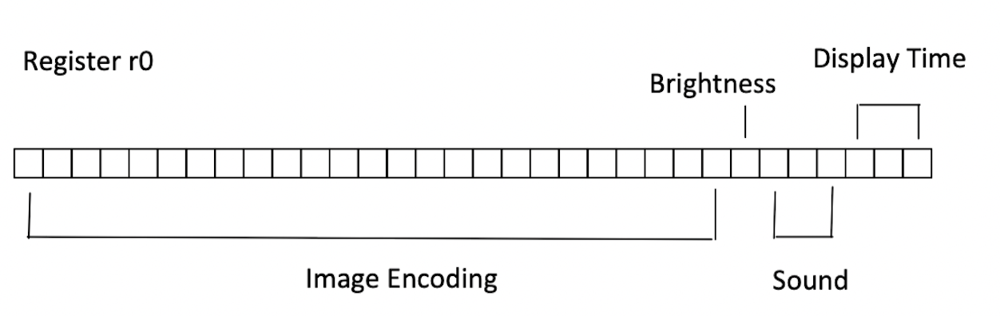

# Design Document

## Overview

This is a program that allows users to raise a digital dog. It includes the implementation of apparent concurrency of sound and images, PMW, random number generator, `SysTick` and `GPIOTE` handler, and record data structure.

## Description

The dog's friendship and hunger levels are from 0 to 5. The hunger level decreases by 1 every 20s. Whenever the friendship level reaches 5, the game is completed, and either friendship or hunger levels reaching 0 make the game over.

* **Idle**:
When users start up the pet, it is in an idle state with a smile or angry face depending on the current friendship and blinks its eyes randomly. Pressing the A or B buttons will let it look to the left or right.

* **Eating**:
Users can feed the dog by pressing the face touch in an idle state but feeding when the hunger level is 5 will decrement friendship.

* **Playing-pending**:
Every 10s, if in an idle state, there is a 50% chance that the dog will ask to play a mini-game. Users can accept it by any front button. Ignoring will decrement the friendship.

* **Playing**:
The dog walks through the screen 5 times, and users need to press the button whenever the dog's whole body is inside the screen and score at least 3/5 to win the mini-game. Rewards and punishments are both friendship levels.

* **Show status**:
No matter what state the dog is in, touching Ring 2 will show the dog's current friendship and hunger level.

## Implementation

The program works heavily depending on the state variable in the dog's record. The `main_loop` of the program consists of a case expression that constantly detects the change of state and executes different branches of code accordingly. Whenever `SysTick` or `GPIOTE` handler is triggered, they check the dog's state first and call the corresponding sub handler belonging to that state. For example, if a user presses a button and triggers `GPIOTE` handlers when the dog is playing-pending, `GPIOTE` handler will call the sub handler `set_state_to_playing` to change the dog's state to playing. After `playing_pending_state` is finished back to Main, the case expression checks the dog's state and decides to execute `playing_state` (figure 1). The apparent concurrency of sound and image is achieved by adding sound function between the on and off of LEDs in each row. Specifically, the program's display order is row 5 turning on, playing music, row 5 turning off, row 4 turning on, and playing music… All images, sound, time and brightness of a frame in animation are encoded as the following (figure 2).

Figure 1: State Transfer

Figure 2: Image Encoding

## Reflection

Unlike light shows, the digital pet contains much logic, which is difficult to ensure it works as expected by just observing. Therefore, I wrote some unit tests in `test.S`. This decision has dramatically improved my efficiency in programming. Testing by starting up the pet is essential but time-consuming. The unit test helped me detect minor errors in advance so I could start up the pet less frequently. Since the program needs to access the dog's record data often. I wrote some setters and getters functions in `data.S`. This decision increases conciseness and efficiency and reduces the chance of generating errors when using `ldr` instruction. During using control flow, I avoided using only `if` or `while_1` and used labels such as `while_playing_pending`, making the code more descriptive and easily avoiding the repetition of labels. Using states to disable buttons instead of disabling `GPIOTE` has allowed me to manage buttons flexibly. For example, disabling buttons A and B in the mini-game while keeping Ring 2 active may not be achieved by disabling the whole `GPIOTE`.

